# Arduino Spede

A multi-game reaction time tester for Arduino Mega, featuring four game modes, a 16×2 I²C LCD, a 4-digit 7-segment display (driven by a 74HC595 shift register), four LEDs, four buttons, and a piezo speaker. High scores are persisted to on-board EEPROM.

> Original project by Petri Häkkinen.
> More info, pictures and videos: http://petenpaja.blogspot.com

---

## Hardware Requirements

| Component         | Details                                                   |
| ----------------- | --------------------------------------------------------- |
| Microcontroller   | Arduino Mega 2560                                         |
| LCD               | 16×2 I²C LCD, address `0x27` (LiquidCrystal_I2C)          |
| 7-segment display | 4-digit common-cathode, driven via 74HC595 shift register |
| Shift register    | 74HC595                                                   |
| Digit switching   | 4× NPN transistors (one per digit)                        |
| LEDs              | 4× LEDs with current-limiting resistors                   |
| Buttons           | 4× momentary push-buttons                                 |
| Speaker           | Piezo buzzer / small speaker                              |

---

## Pin Assignments

| Arduino Pin | Connected To                   | Notes                                 |
| ----------- | ------------------------------ | ------------------------------------- |
| 2           | LED 1                          |                                       |
| 3           | LED 2                          |                                       |
| 4           | LED 3                          |                                       |
| 5           | LED 4                          |                                       |
| 6           | Button 1                       | INPUT_PULLUP                          |
| 7           | Button 2                       | INPUT_PULLUP                          |
| 8           | Button 3                       | INPUT_PULLUP                          |
| 9           | Piezo speaker                  | `tone()` output                       |
| 10          | Button 4                       | INPUT_PULLUP                          |
| 11          | Digit 3 enable transistor base |                                       |
| 12          | Digit 4 enable transistor base |                                       |
| 13          | Digit 1 enable transistor base |                                       |
| 23          | Digit 2 enable transistor base | Moved from pin 10 to resolve conflict |
| 20 (SDA)    | 74HC595 Latch + I²C SDA        | Shared — LCD and shift register       |
| 21 (SCL)    | 74HC595 Clock + I²C SCL        | Shared — LCD and shift register       |
| 22          | 74HC595 Data (SER)             |                                       |

> **Note:** Pins 20/21 are shared between the 74HC595 and the I²C LCD. These are as present in the original code; adjust for your build if needed.

---

## Wiring Diagram

```mermaid
graph TD
    MEGA["Arduino Mega 2560"]

    subgraph I2C["I²C Bus (pins 20 SDA / 21 SCL)"]
        LCD["16×2 LCD\n(addr 0x27)"]
    end

    subgraph SR["Shift Register"]
        HC595["74HC595\nSER=pin22  RCLK=pin20  SRCLK=pin21"]
        SEG["4-Digit 7-Segment Display\n(segments A–G)"]
        HC595 -->|"QA–QG"| SEG
    end

    subgraph DIGITS["Digit Select (NPN transistors)"]
        D1["Digit 1 — pin 13"]
        D2["Digit 2 — pin 23"]
        D3["Digit 3 — pin 11"]
        D4["Digit 4 — pin 12"]
    end

    subgraph LEDS["LEDs (with resistors)"]
        L1["LED 1 — pin 2"]
        L2["LED 2 — pin 3"]
        L3["LED 3 — pin 4"]
        L4["LED 4 — pin 5"]
    end

    subgraph BTNS["Buttons (INPUT_PULLUP → GND)"]
        B1["Button 1 — pin 6"]
        B2["Button 2 — pin 7"]
        B3["Button 3 — pin 8"]
        B4["Button 4 — pin 10"]
    end

    EEPROM["On-board EEPROM\n(hi-score bytes 0–1)"]
    SPK["Piezo Speaker — pin 9"]

    MEGA -- I2C --> LCD
    MEGA -- "SER/RCLK/SRCLK" --> HC595
    MEGA -- "pins 13,23,11,12" --> D1 & D2 & D3 & D4
    D1 & D2 & D3 & D4 -- "common cathode" --> SEG
    MEGA --> L1 & L2 & L3 & L4
    B1 & B2 & B3 & B4 -- "to GND" --> GND["GND"]
    MEGA --- B1 & B2 & B3 & B4
    MEGA -- "tone()" --> SPK
    MEGA <-- "EEPROM.read/write" --> EEPROM
```

---

## Libraries Required

Install via the Arduino Library Manager or add to `platformio.ini`:

- **LiquidCrystal_I2C** (`marcoschwartz/LiquidCrystal_I2C`) — for the I²C LCD
- **Wire** — built-in, required for I²C
- **EEPROM** — built-in

---

## Game Modes

Select a game from the start menu by pressing the corresponding button. The LCD shows the menu name; the 7-segment display alternates between the previous score and the all-time high score.

| Button | Game         | Description                                                                                                                                                                                                                    |
| ------ | ------------ | ------------------------------------------------------------------------------------------------------------------------------------------------------------------------------------------------------------------------------ |
| 1      | **Standard** | A random LED lights up; press the matching button before the countdown expires. Speed increases each level. Wrong press or timeout = game over.                                                                                |
| 2      | **Speed**    | Press the correct button for each lit LED as fast as possible. 10-second countdown shown on LCD. Score = number of correct presses.                                                                                            |
| 3      | **Memory**   | Simon Says. The Arduino plays a growing sequence of LED flashes; repeat the sequence using the corresponding buttons. Score = length of longest sequence completed. Wrong press = game over.                                   |
| 4      | **1v1**      | Two-player reaction test. After a random 1–5 second delay, LEDs 1 and 4 light up simultaneously. The first player to press their button wins; their tone plays and their LED stays lit. Score = reaction time in milliseconds. |

### Button-to-Tone Mapping

| Button | Note         |
| ------ | ------------ |
| 1      | C♯4 (277 Hz) |
| 2      | D♯4 (311 Hz) |
| 3      | F♯4 (370 Hz) |
| 4      | G♯4 (415 Hz) |

---

## Hi-Score

- Stored in EEPROM bytes 0–1 as a big-endian 16-bit value.
- **Reset hi-score:** hold all four buttons simultaneously for 2 seconds from the start menu.

---

## Building & Uploading

### Arduino IDE

1. Open `spede/spede.ino`.
2. Install **LiquidCrystal_I2C** via Library Manager (search `marcoschwartz LiquidCrystal_I2C`).
3. Select your board and the correct COM port.
4. Click **Upload**.

### PlatformIO (recommended)

1. Open the project folder in VS Code with the PlatformIO extension installed.
2. The `platformio.ini` already declares the library dependency — it will be downloaded automatically.
3. Select the environment matching your board:
   - `nanoatmega328new` — Arduino Nano clone with ATmega328P (most common, 115200 baud bootloader)
4. Run **PlatformIO: Upload**.

---

## License

MIT License — Copyright (c) 2013 Petri Häkkinen. See source file for full license text.
